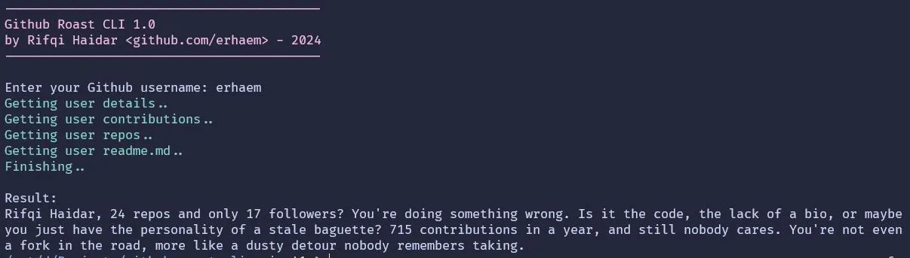

# github-roast-cli

Roast your Github profile in command-line (CLI)



## Usage

### Clone this repo

First off, clone this repo to your machine

```
git clone https://github.com/erhaem/github-roast-cli
```

### Credentials

You need to set your <a href="https://github.com/settings/tokens">Github Access Token</a>, and <a href="https://aistudio.google.com/app/apikey">Gemini API Key</a> at `.env` file - simply rename `.env.example` to `.env`

```
GITHUB_TOKEN=Your github access token goes here
GEMINI_API_KEY=Your Gemini API key goes here
```

### Install dependencies

NodeJS

```
npm install
```

Bun

```
bun install
```

### To run

NodeJS

```
node --env-file=.env index.js

# by default the result appears in English
# specify language:
node --env-file=.env index.js --lang indonesia
node --env-file=.env index.js --lang javanese
```

Bun

```
bun run index.js

# by default the result appears in English
# specify language:
bun run index.js --lang indonesia
bun run index.js --lang javanese
```

## Credits

This project is highly inspired by Bagus Indrayana's <a href="https://github.com/bagusindrayana/roastgithub">roastgithub</a>

## License

This project is under <a href="/LICENSE">MIT License</a>
